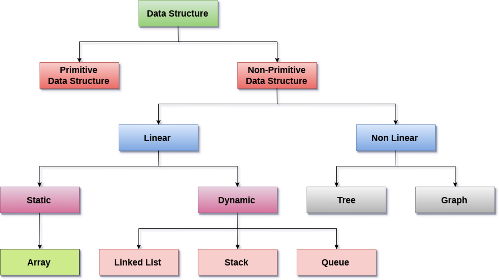
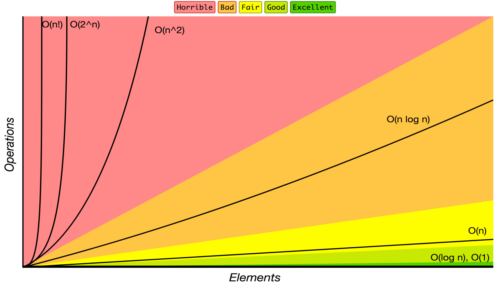

# Data Structure in JavaScript

## Data Structure

A _Data structure_ is a collection of data values, the relationship among them and operations applied to data. Data structure enables efficient access and modification of data.

## Data Structure Classification

A _data structure_ can be classified into two categories. There are various ways to classify data structure:

- Primitive and Non-Primitive Data Structure

  A _primitive data structure_ is an atomic data structure.

  A _non-primitive data structure_ is a non-atomic data structure.

- Linear and Non-Linear Data Structure

  In a _linear data structure_, the data items are in a linear sequence.

  In a _non-linear data structure_, the data items are not in sequence.

- Static and Dynamic Data Structure

  A _static data structure_ is a data structure whose size, structure, associated location is fixed at compile time.

  A _dynamic data structure_ is a data structure whose size and structure expand and shrink as required and there associate memory location change.

## Usage

_Data structures_ serve as the basis for abstract data types(ADT). The ADT defines the logical form of the data type. The data structure implements the physical form of the data type.

_Data structures_ provide a means to manage large amounts of data efficiently for uses. Data structures can be used to organize the storage and retrieval of information.

## Big O Notation

_Big O notation_ is used to classify algorithms according to how their running time or space requirements grow as the input size grows.

Big O notations and their performance comparisons

| Big O Notation | Computations for 10 elements | Computations for 100 elements | Computations for 1000 elements |
| :------------- | :--------------------------- | :---------------------------- | :----------------------------- |
| **O(1)**       | 1                            | 1                             | 1                              |
| **O(log N)**   | 3                            | 6                             | 9                              |
| **O(N)**       | 10                           | 100                           | 1000                           |
| **O(N log N)** | 30                           | 600                           | 9000                           |
| **O(N^2)**     | 100                          | 10000                         | 1000000                        |
| **O(2^N)**     | 1024                         | 1.26e+29                      | 1.07e+301                      |
| **O(N!)**      | 3628800                      | 9.3e+157                      | 4.02e+2567                     |

Data Structure Operations Worst Complexity

| Data Structure         | Access | Search | Insertion | Deletion | Comments                   |
| ---------------------- | :----: | :----: | :-------: | :------: | :------------------------- |
| **Array**              |  O(1)  |  O(n)  |   O(n)    |   O(n)   |                            |
| **Stack**              |  O(n)  |  O(n)  |   O(1)    |   O(1)   |                            |
| **Queue**              |  O(n)  |  O(n)  |   O(1)    |   O(1)   |                            |
| **Linked List**        |  O(n)  |  O(n)  |   O(1)    |   O(n)   |                            |
| **Hash Table**         |  N/A   |  O(n)  |   O(n)    |   O(n)   | perfect hash --> O(1)      |
| **Binary Search Tree** |  O(n)  |  O(n)  |   O(n)    |   O(n)   | balanced tree --> O(log n) |

## Contributing

Pull requests are welcome. For major changes, please open an issue first to discuss what you would like to change.

Please make sure to update tests as appropriate.
